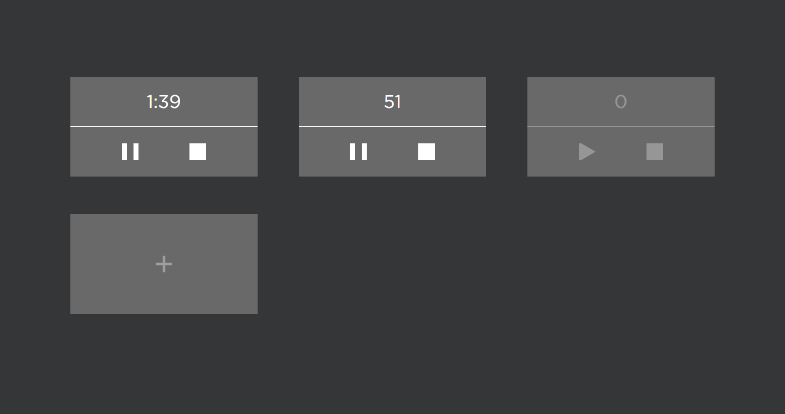

# Sropwachers

[Ссылка на проект](https://n-daria.github.io/Stopwatchers)

Секундомер. Можно добавлять несколько, они работают независимо друг от друга.
Каждый секундомер имеет 3 функции:
- запуск
- пауза
- сброс

  

## Используемые технологии

- Адаптивная верстка (БЭМ, Flexbox, grid)
- JavaScript
- Vue 3

## Инструкцию по развертыванию проекта

git clone https://github.com/N-Daria/Stopwatchers.git  
npm i  
npm run serve

## Планы по доработке проекта

1. Переписать изменение пропсов
2. Переписать повторяющиеся стили в единый компонет
